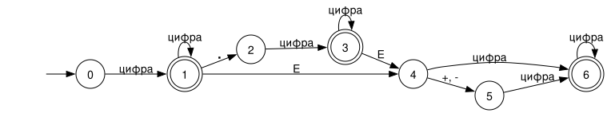

# Автомат для чисел

Регулярное выражение: `digit+(.digit+)?(E(+|-)?digit+)?`

Начальное состояние 0, допускающие 1, 3 и 6 (двойной кружок). Переходы, которых нет на схеме, ведут в состояние 7 (ошибка), из него автомат уже не выходит

| Состояние | цифра | `.` | `E` | `+` | `-` | другой символ |
|:---:|:---:|:---:|:---:|:---:|:---:|:---:|
| 0 | 1 | 7 | 7 | 7 | 7 | 7 |
| 1 | 1 | 2 | 4 | 7 | 7 | 7 |
| 2 | 3 | 7 | 7 | 7 | 7 | 7 |
| 3 | 3 | 7 | 4 | 7 | 7 | 7 |
| 4 | 6 | 7 | 7 | 5 | 5 | 7 |
| 5 | 6 | 7 | 7 | 7 | 7 | 7 |
| 6 | 6 | 7 | 7 | 7 | 7 | 7 |
| 7 | 7 | 7 | 7 | 7 | 7 | 7 |

Что значат состояния:

- 0: ещё ничего не прочитано
- 1: целая часть, например `12`
- 2: прочитана точка, дальше нужна цифра
- 3: дробная часть, например `12.5`
- 4: прочитана `E`, дальше знак или цифра
- 5: прочитан знак порядка, дальше нужна цифра
- 6: порядок, например `12.5E-3`
- 7: ошибка
